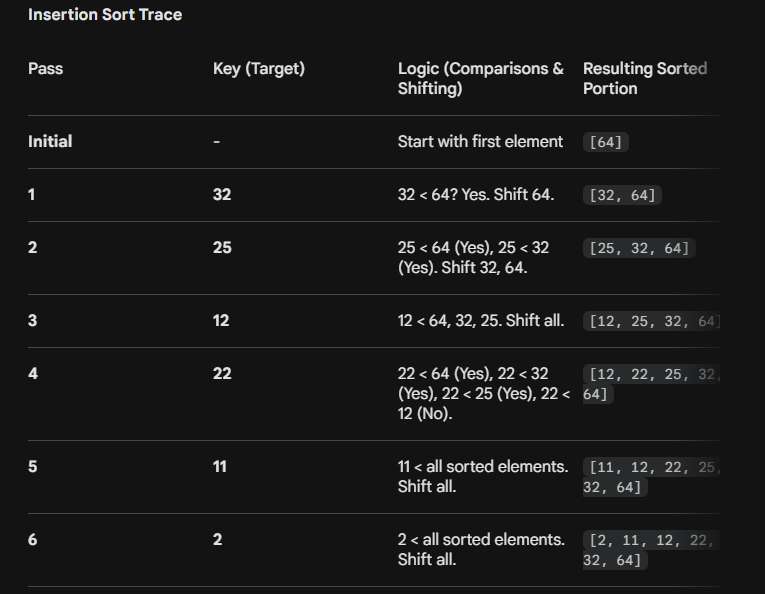

Certainly! Let's walk through the insertion sort algorithm for the array `[23, 1, 10, 5, 2]` using the same logic as your example.

The algorithm works by iterating through the array and "inserting" each element into its correct sorted position relative to the elements already processed (the sorted subarray).

### Insertion Sort Trace
**Initial Array:** `[23, 1, 10, 5, 2]`

* **Initial State:** The first element (`23`) is assumed to be sorted.
    * Sorted portion: `[23]`

---

* **First Pass (Key = 1):**
    * We compare `1` with `23`. Since `1 < 23`, we shift `23` to the right and insert `1` at the beginning.
    * Sorted portion: `[1, 23]`

* **Second Pass (Key = 10):**
    * We compare `10` with `23`. `10 < 23`, so we shift `23` right.
    * We compare `10` with `1`. `10 > 1`, so we place `10` after `1`.
    * Sorted portion: `[1, 10, 23]`

* **Third Pass (Key = 5):**
    * We compare `5` with `23`. `5 < 23`, shift `23` right.
    * We compare `5` with `10`. `5 < 10`, shift `10` right.
    * We compare `5` with `1`. `5 > 1`, so we place `5` after `1`.
    * Sorted portion: `[1, 5, 10, 23]`

* **Fourth Pass (Key = 2):**
    * We compare `2` with `23`, `10`, and `5`. All are greater, so we shift them all to the right.
    * We compare `2` with `1`. `2 > 1`, so we place `2` after `1`.
    * Sorted portion: `[1, 2, 5, 10, 23]`

---

**Final Result:** `[1, 2, 5, 10, 23]`

That format is perfect for exam preparation. Since you provided the template for Selection Sort, here is the algorithm for **Insertion Sort** using the exact same structure to keep your notes consistent.

---

# ✅ Algorithm: Insertion Sort

**Algorithm Name:** `INSERTION_SORT(A, n)`
Where:
* `A` = Array
* `n` = Number of elements

---

### **Step 1:** Start

### **Step 2:** Read array `A` of size `n`

### **Step 3:** For `i = 1` to `n - 1` do

    3.1 Set `key ← A[i]`
    👉 The element to be inserted into the sorted sub-list

    3.2 Set `j ← i - 1`

    3.3 While `j >= 0` AND `A[j] > key` do
        a) Set `A[j + 1] ← A[j]`
           👉 Shift larger elements to the right
        b) Set `j ← j - 1`

    3.4 Set `A[j + 1] ← key`
        👉 Insert key into its correct position

### **Step 4:** End outer loop

### **Step 5:** Output sorted array

### **Step 6:** Stop

---

# 📌 Key Idea (for Viva)

* **Divide and Conquer:** Maintain a "sorted" sub-list on the left and an "unsorted" sub-list on the right.
* **Extraction:** Take one element from the unsorted part (the "key").
* **Comparison & Shift:** Compare it with elements in the sorted part, shifting them to the right until you find the correct slot.
* **Insertion:** Place the key in the empty slot.

---

# 📊 Complexity (Important for Exam)

* **Best Case** = $O(n)$ (When the array is already sorted)
* **Average Case** = $O(n^2)$
* **Worst Case** = $O(n^2)$ (When the array is in reverse order)
* **Space Complexity** = $O(1)$ (It is an *in-place* sorting algorithm)