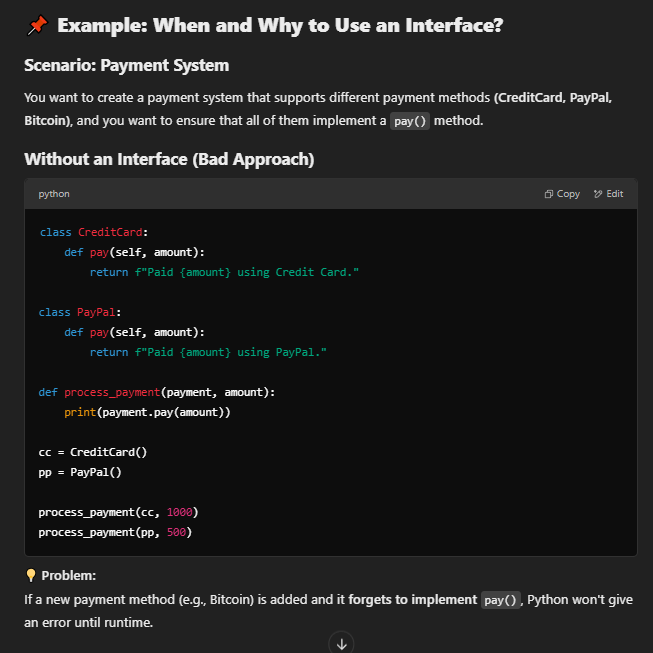
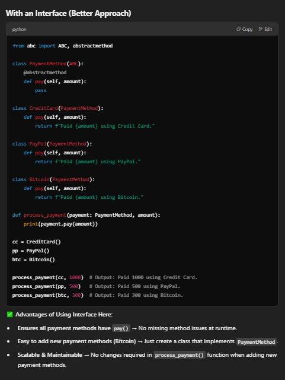
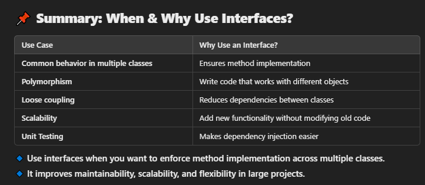

When and Why to Use Interfaces in a Program?
Using interfaces in Python (via Abstract Base Classes - ABC) is beneficial in object-oriented programming (OOP) when you want to enforce a contract for implementing classes. This ensures that certain methods are present in all subclasses, improving code structure, maintainability, and flexibility.

📌 When to Use Interfaces?
You should use an interface in a program when:

You want to enforce method implementation

If multiple classes must have common behavior but implement it differently.
Example: Bird interface with a fly() method that Eagle and Parrot implement differently.
You need polymorphism (code that works with multiple classes seamlessly)

A function can work with any class implementing the interface without worrying about specific implementation details.
Example: A Vehicle interface where Car, Bike, and Truck implement start_engine(). A common function can start any vehicle without knowing its type.
You are designing large, scalable applications

When working on a team project, interfaces help different team members work on different implementations while following a common contract.
You need to support multiple implementations

Example: PaymentMethod interface for CreditCard, PayPal, UPI. Any new payment method can be added without modifying existing code.
You want to achieve loose coupling

Reduces dependencies between classes, making code more modular and testable.
Example: A logging system where multiple loggers (FileLogger, DatabaseLogger, ConsoleLogger) implement a log_message() method.
📌 Why Use Interfaces?
✅ 1. Enforces a Standard Structure

Ensures all classes implementing the interface provide required methods.
Example: DatabaseConnection interface enforces that all databases (MySQL, PostgreSQL, MongoDB) have connect() and disconnect() methods.
✅ 2. Supports Multiple Implementations

Allows defining a general structure that different classes can implement in their own way.
Example: Shape interface for Circle, Rectangle, and Triangle, each implementing area() differently.
✅ 3. Improves Code Maintainability

New implementations can be added without modifying existing code.
Example: A PaymentGateway interface lets you add support for new payment providers (Razorpay, Stripe) without changing old code.
✅ 4. Enables Polymorphism

A function or class can work with different objects following the same interface, making the code flexible.
Example:
python
Copy
Edit
def process_payment(payment: PaymentMethod, amount):
    payment.pay(amount)
Works for CreditCard, PayPal, UPI, etc.
✅ 5. Makes Code More Testable

Dependency injection: Interfaces allow mocking dependencies during unit testing.
Example: A Logger interface allows swapping real logging with a MockLogger for testing.

